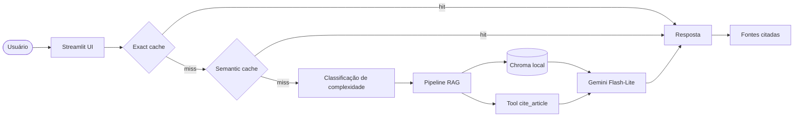

# LGPD Dev Checker

> Assistente RAG para ajudar desenvolvedores a consultar trechos da LGPD e materiais da ANPD com respostas fundamentadas em fontes.

**Live demo:** [Acessar aplicação](https://lgpd-dev-checker-uxpruybqkgou9mvreffnwu.streamlit.app/)

**Video demo:** [Assistir apresentação](https://drive.google.com/file/d/1NtP9dptQ33H25-lQRYfyTzP4ADVSGqr3/view?usp=sharing)

## Problem statement

Desenvolvedores que trabalham com dados pessoais precisam consultar a LGPD e recomendações da ANPD durante decisões técnicas como cadastro de usuários, tratamento de dados sensíveis, segurança da informação e transparência no uso de dados.

O problema é que esses documentos são extensos e nem sempre é rápido encontrar o trecho certo para responder uma dúvida prática.

O **LGPD Dev Checker** resolve esse problema com uma aplicação RAG: o usuário faz uma pergunta em linguagem natural, o sistema recupera trechos relevantes, depois gera uma resposta objetiva e exibe as fontes usadas.

## Corpus

O corpus inicial é composto por documentos em PDF armazenados em `data/corpus/`.

| Documento                                           |                               Arquivo | Páginas |
| --------------------------------------------------- | ------------------------------------: | ------: |
| Lei Geral de Proteção de Dados Pessoais - LGPD      |                `data/corpus/lgpd.pdf` |      26 |
| Guia Orientativo de Segurança da Informação da ANPD | `data/corpus/guia-seguranca-anpd.pdf` |      21 |

Total inicial: **47 páginas**.

Durante os testes locais, o pipeline gerou aproximadamente **232 chunks** indexados no Chroma.

## Perguntas de exemplo

```text
O que é dado pessoal?
```

```text
O que diz o Art. 5 da LGPD?
```

```text
Explique a diferença entre dado pessoal e dado pessoal sensível na LGPD.
```

```text
Quais cuidados de segurança da informação são recomendados para pequenos agentes de tratamento?
```

## Arquitetura



## Como funciona

O usuário faz uma pergunta na interface do Streamlit sobre LGPD, dados pessoais ou segurança da informação.

Antes de gerar uma nova resposta, o sistema verifica se essa pergunta já foi respondida antes. Primeiro ele procura uma pergunta exatamente igual no **ExactCache**. Depois procura perguntas parecidas no **SemanticCache**. Se encontrar uma resposta salva, o app responde mais rápido e evita uma nova chamada ao modelo.

Se não encontrar nada no cache, o sistema classifica a pergunta como simples ou complexa usando o módulo de **routing**. Essa classificação aparece na interface e também é salva nos logs para acompanhar o comportamento do app.

Depois disso, o pipeline RAG busca no Chroma os trechos dos PDFs mais relacionados a pergunta. Se a pergunta citar um artigo específico da LGPD como “Art. 5”, a ferramenta `cite_article` busca esse artigo diretamente no PDF da LGPD.

Por fim, o modelo recebe a pergunta e os trechos encontrados, gera uma resposta e mostra as fontes usadas. A resposta também é salva no cache para acelerar perguntas futuras.
## Componentes principais

| Componente      | Arquivo                      | Função                                                      |
| --------------- | ---------------------------- | ----------------------------------------------------------- |
| Interface       | `src/ui/streamlit_app.py`    | Entrada do usuário, exibição da resposta, fontes e métricas |
| Pipeline RAG    | `src/pipeline/rag.py`        | Indexação, recuperação e geração da resposta                |
| Tool-use        | `src/pipeline/tools.py`      | Consulta determinística de artigos da LGPD                  |
| Cache           | `src/pipeline/cache.py`      | Exact cache e semantic cache local                          |
| Routing         | `src/pipeline/routing.py`    | Classificação de complexidade da pergunta                   |
| Observabilidade | `src/observability/trace.py` | Logs estruturados com `trace_id` e latência                 |

## Tool-use

A ferramenta customizada do domínio é:

```python
cite_article(article_number: int) -> str
```

Ela recebe o número de um artigo e busca o texto correspondente no arquivo local da LGPD:

```text
data/corpus/lgpd.pdf
```

Exemplo:

```python
cite_article(5)
```

Essa tool melhora a confiabilidade em perguntas como:

```text
O que diz o Art. 5 da LGPD?
```

Em vez de depender apenas da geração do modelo, o sistema consulta diretamente o trecho do documento.

## Cache e redução de custo

O projeto usa duas camadas de cache:

| Camada         | Estratégia          | Objetivo                                               |
| -------------- | ------------------- | ------------------------------------------------------ |
| Exact cache    | Hash da pergunta    | Responder imediatamente quando a pergunta for idêntica |
| Semantic cache | Vetor lexical local | Reaproveitar respostas de perguntas parecidas          |

O cache semântico foi implementado de forma local para evitar chamadas externas de embedding durante desenvolvimento e deploy.

Durante um teste local, uma pergunta simples sem cache levou cerca de **2,9 segundos** de latência total:

```json
{
  "event": "query_handle_end",
  "latency_ms": 2946.99
}
```

Após a primeira execução, perguntas repetidas podem ser respondidas pelo cache, reduzindo novas chamadas ao LLM.

## Routing

O módulo de routing classifica perguntas em 2 níveis:

| Classificação | Exemplo                                           | Uso atual                 |
| ------------- | ------------------------------------------------- | ------------------------- |
| `simple`      | “O que é dado pessoal?”                           | Log, UI e observabilidade |
| `complex`     | “Explique e compare dado pessoal e dado sensível” | Log, UI e observabilidade |

No projeto atual, o routing não troca automaticamente o modelo da resposta final. Ele registra a decisão e prepara a arquitetura para evolução futura com roteamento real entre modelos.

O modelo principal usado na geração é configurado por variável de ambiente:

```env
LLM_MODEL=gemini-2.5-flash-lite
```

## Observabilidade

Cada pergunta gera logs estruturados com:

* `trace_id`
* evento inicial
* decisão de routing
* quantidade de fontes usadas
* latência total

Exemplo:

```json
{
  "event": "query_handle_end",
  "trace_id": "2160a616-e41a-40ee-b677-14d7de2e4a2d",
  "query": "O que é dado pessoal?",
  "latency_ms": 2946.99
}
```

Esses logs ajudam a acompanhar custo, latência, comportamento do cache e fluxo de execução.

## Setup local

### 1. Clone o repositório

```bash
git clone <url-do-repositorio>
cd lgpd-dev-checker
```

### 2. Crie e ative o ambiente

No Windows PowerShell:

```powershell
uv venv
.\.venv\Scripts\Activate.ps1
uv sync --extra dev
```

Em Linux/macOS:

```bash
uv venv
source .venv/bin/activate
uv sync --extra dev
```

### 3. Configure as variáveis de ambiente

Copie o arquivo de exemplo:

```bash
cp .env.example .env
```

No Windows PowerShell:

```powershell
Copy-Item .env.example .env
```

Configure o `.env`:

```env
GEMINI_API_KEY=sua_chave_real
LLM_MODEL=gemini-2.5-flash-lite
CHEAP_MODEL=gemini-2.5-flash-lite
PREMIUM_MODEL=gemini-2.5-flash-lite
EMBED_MODEL=local
```

### 4. Verifique o corpus

Os PDFs devem estar em:

```text
data/corpus/
├── guia-seguranca-anpd.pdf
└── lgpd.pdf
```

### 5. Rode os testes

```bash
uv run pytest tests/test_smoke.py -v
```

Resultado esperado:

```text
3 passed
```

### 6. Rode a interface

```bash
uv run streamlit run src/ui/streamlit_app.py
```

A aplicação abrirá em:

```text
http://localhost:8501
```

## Deploy no Streamlit Cloud

Configuração sugerida:

| Campo          | Valor                            |
| -------------- | -------------------------------- |
| Repository     | Repositório do projeto no GitHub |
| Branch         | `main`                           |
| Main file path | `src/ui/streamlit_app.py`        |

Secrets necessários no Streamlit Cloud:

```toml
GEMINI_API_KEY = "sua_chave_real"
LLM_MODEL = "gemini-2.5-flash-lite"
CHEAP_MODEL = "gemini-2.5-flash-lite"
PREMIUM_MODEL = "gemini-2.5-flash-lite"
EMBED_MODEL = "local"
```

As chaves devem ser configuradas nos secrets do Streamlit Cloud, não commitadas no repositório.

## Design decisions

* **Corpus oficial e enxuto:** o projeto usa documentos diretamente relacionados a LGPD e a ANPD, mantendo o escopo controlado.
* **Chroma local:** adequado para corpus pequeno, simples de testar e compatível com deploy sem banco externo.
* **Chunking com overlap:** usado para preservar contexto entre trechos próximos dos PDFs.
* **Tool para artigos da LGPD:** melhora perguntas que exigem consulta precisa a um artigo específico.
* **Embedding local:** evita dependência de cota externa para indexação e cache semântico.
* **Cache em duas camadas:** reduz chamadas repetidas ao LLM e melhora a experiência do usuário.
* **Routing separado do RAG:** permite observar a complexidade das perguntas sem acoplar a decisão ao modelo final nesta versão.

## Limitations

* O corpus é fixo e limitado aos PDFs incluídos em `data/corpus/`.
* O app ainda não permite upload de documentos pelo usuário.
* O cache semântico usa hashing lexical local mais simples que embeddings semânticos dedicados.
* O routing atual registra a decisão mas ainda não troca dinamicamente o modelo de geração.
* A extração de texto depende da qualidade dos PDFs e documentos escaneados sem OCR podem não funcionar bem.

## Tech stack

* **Python**
* **Streamlit**
* **Gemini 2.5 Flash-Lite**
* **Chroma**
* **PyPDF**
* **LangChain Text Splitters**
* **Pytest**
* **uv**
* **Logs estruturados com trace_id**

## Estrutura do projeto

```text
lgpd-dev-checker/
├── data/
│   ├── corpus/
│   │   ├── guia-seguranca-anpd.pdf
│   │   └── lgpd.pdf
│   └── chroma/
├── docs/
│   └── observability.md
├── src/
│   ├── ui/
│   │   └── streamlit_app.py
│   ├── pipeline/
│   │   ├── rag.py
│   │   ├── tools.py
│   │   ├── cache.py
│   │   └── routing.py
│   └── observability/
│       └── trace.py
├── tests/
│   └── test_smoke.py
├── pyproject.toml
├── uv.lock
├── .env.example
└── README.md
```

## Status dos TODOs do template

| TODO   | Arquivo                                        | Status                          |
| ------ | ---------------------------------------------- | ------------------------------- |
| TODO 1 | `src/pipeline/rag.py::ingest_and_index`        | Implementado                    |
| TODO 2 | `src/pipeline/rag.py::retrieve`                | Implementado                    |
| TODO 3 | `src/pipeline/rag.py::answer`                  | Implementado                    |
| TODO 4 | `src/pipeline/tools.py`                        | Implementado com `cite_article` |
| TODO 5 | `src/pipeline/cache.py::SemanticCache.get`     | Implementado                    |
| TODO 6 | `src/pipeline/routing.py::classify_complexity` | Implementado                    |
